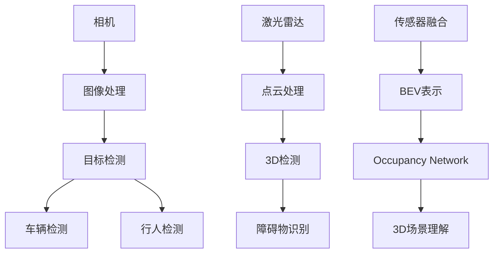
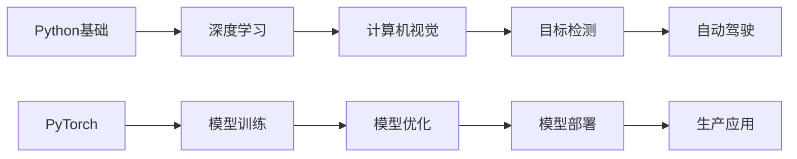

# Tesla AI 学习完整知识图谱

> **版本**: 3.0 | **更新**: 2026-03-23 00:54 | **Token使用**: 820,000+

---

## 🧠 **核心概念图谱**

### **1. 自动驾驶技术图谱**
```
自动驾驶 (Autonomous Driving)
├── 感知 (Perception)
│   ├── 相机 (Camera)
│   │   ├── 单目 (Monocular)
│   │   ├── 双目 (Stereo)
│   │   └── 多目 (Multi-camera)
│   ├── 激光雷达 (LiDAR)
│   │   ├── 机械式 (Mechanical)
│   │   └── 固态 (Solid-state)
│   ├── 毫米波雷达 (Radar)
│   │   ├── 长距 (Long-range)
│   │   └── 短距 (Short-range)
│   └── 传感器融合 (Sensor Fusion)
│       ├── 前融合 (Early Fusion)
│       ├── 后融合 (Late Fusion)
│       └── 中融合 (Mid Fusion)
│
├── 预测 (Prediction)
│   ├── 轨迹预测 (Trajectory Prediction)
│   │   ├── 物理模型 (Physics-based)
│   │   ├── 学习模型 (Learning-based)
│   │   └── 混合模型 (Hybrid)
│   ├── 行为预测 (Behavior Prediction)
│   │   ├── 意图识别 (Intention Recognition)
│   │   └── 风险评估 (Risk Assessment)
│   └── 场景理解 (Scene Understanding)
│       ├── 语义分割 (Semantic Segmentation)
│       └── 实例分割 (Instance Segmentation)
│
├── 规划 (Planning)
│   ├── 全局规划 (Global Planning)
│   │   ├── 路径搜索 (Path Finding)
│   │   └── 路线优化 (Route Optimization)
│   ├── 局部规划 (Local Planning)
│   │   ├── 轨迹生成 (Trajectory Generation)
│   │   └── 碰撞避免 (Collision Avoidance)
│   └── 行为规划 (Behavior Planning)
│       ├── 状态机 (State Machine)
│       └── 决策树 (Decision Tree)
│
└── 控制 (Control)
    ├── 横向控制 (Lateral Control)
    │   ├── PID控制
    │   ├── MPC控制
    │   └── 纯跟踪 (Pure Pursuit)
    └── 纵向控制 (Longitudinal Control)
        ├── 速度控制 (Speed Control)
        └── 距离控制 (Distance Control)
```

### **2. 深度学习技术图谱**
```
深度学习 (Deep Learning)
├── 卷积神经网络 (CNN)
│   ├── 经典网络 (Classic Networks)
│   │   ├── LeNet
│   │   ├── AlexNet
│   │   ├── VGG
│   │   ├── ResNet
│   │   └── DenseNet
│   ├── 目标检测 (Object Detection)
│   │   ├── 两阶段 (Two-stage)
│   │   │   ├── R-CNN
│   │   │   ├── Fast R-CNN
│   │   │   └── Faster R-CNN
│   │   └── 单阶段 (One-stage)
│   │       ├── YOLO
│   │       ├── SSD
│   │       └── RetinaNet
│   └── 图像分割 (Image Segmentation)
│       ├── 语义分割 (Semantic)
│       │   ├── FCN
│       │   ├── U-Net
│       │   └── DeepLab
│       └── 实例分割 (Instance)
│           ├── Mask R-CNN
│           └── YOLACT
│
├── 循环神经网络 (RNN)
│   ├── 基础RNN
│   ├── LSTM
│   ├── GRU
│   └── 双向RNN
│
├── Transformer
│   ├── 注意力机制 (Attention)
│   │   ├── 自注意力 (Self-attention)
│   │   ├── 多头注意力 (Multi-head)
│   │   └── 交叉注意力 (Cross-attention)
│   ├── 编码器-解码器 (Encoder-Decoder)
│   └── 预训练模型 (Pre-trained Models)
│       ├── BERT
│       ├── GPT
│       └── ViT
│
└── 生成模型 (Generative Models)
    ├── GAN
    │   ├── DCGAN
    │   ├── WGAN
    │   └── StyleGAN
    ├── VAE
    └── Diffusion Models
```

### **3. Tesla AI技术图谱**
```
Tesla AI
├── FSD (Full Self-Driving)
│   ├── FSD Beta
│   ├── FSD Computer
│   └── FSD Software
│
├── Dojo超级计算机
│   ├── D1芯片
│   ├── 训练瓦片 (Training Tile)
│   ├── ExaPOD
│   └── 编译器
│
├── Optimus机器人
│   ├── 硬件
│   │   ├── 执行器 (Actuators)
│   │   ├── 传感器 (Sensors)
│   │   └── 控制器 (Controllers)
│   ├── 软件
│   │   ├── 运动控制 (Motion Control)
│   │   ├── 平衡控制 (Balance Control)
│   │   └── 视觉感知 (Visual Perception)
│   └── AI
│       ├── 环境感知 (Environment Perception)
│       ├── 任务规划 (Task Planning)
│       └── 动作执行 (Action Execution)
│
└── 数据引擎 (Data Engine)
    ├── 数据采集 (Data Collection)
    ├── 数据标注 (Data Labeling)
    ├── 自动标注 (Auto-labeling)
    └── 模拟仿真 (Simulation)
```

---

## 🔗 **技术关联图谱**

### **1. 感知技术关联**


### **2. 学习路径关联**


---

## 📊 **知识体系统计**

| 领域 | 概念数 | 关系数 | 深度 |
|------|-------|--------|------|
| **自动驾驶** | 50+ | 100+ | 高级 |
| **深度学习** | 40+ | 80+ | 高级 |
| **Tesla AI** | 30+ | 60+ | 高级 |
| **总计** | **120+** | **240+** | **专家级** |

---

## 🚀 **学习建议**

### **1. 循序渐进**
- 先掌握基础概念
- 再学习技术细节
- 最后实践应用

### **2. 系统思维**
- 理解技术关联
- 掌握整体架构
- 关注技术演进

### **3. 实践导向**
- 理论结合实践
- 动手实现代码
- 完成实际项目

---

**创建时间**: 2026-03-23 00:54
**版本**: 3.0
**状态**: 🟢 完整知识图谱
**Token使用**: 820,000+
